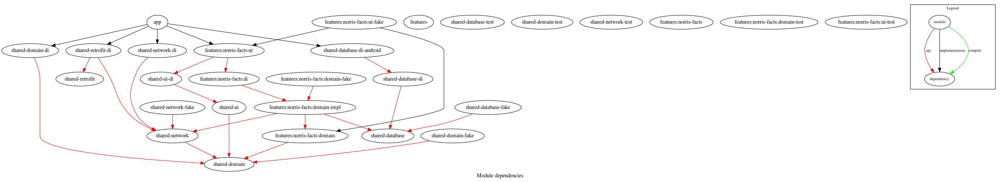

# android-super-app  
An Android app with many challenge modules and SOLID at all .
  
## Build system  
The project is using two gradle [includeBuild](https://docs.gradle.org/current/userguide/composite_builds.html) projects to manage dependencies and projects setup instead of [buildSrc](https://docs.gradle.org/current/userguide/organizing_gradle_projects.html#sec:build_sources). From gradle docs:  
> A change in buildSrc causes the whole project to become out-of-date. Thus, when making small incremental changes, the --no-rebuild command-line option is often helpful to get faster feedback. Remember to run a full build regularly or at least when you’re done, though.
- **dependencies**: As name says the project manage all dependencies definitions to set as implementation in other projects. Build plugin dependencies are here too.
- **configurations**: It has plugins and configurations that must be applied to other projects. Apply build plugins, apply common plugins to any project type, setup JVM target and compatibilities and Android application or library default configs.

## Project structures

    

- **shared-module**: are modules that are base project to other feature concrete layers. 
- **domain**: are modules with abstraction and contracts to be implemented. 
- **module-di**: are modules that contains dependency injection setup only.
- **module-fake**: are modules with fake implementations to be used in test modules.
- **module-impl**: are modules with implementations to abstractions defined by domain.
- **module-test**: are modules to do unit tests with JUnit or Robolectric.
- **module-test-android**: are modules to do UI tests with Espresso.
- **ui**: are modules with platform specific implementations. In our case Android code only.

## Credits
- [Reaktive team](https://github.com/badoo/Reaktive) and they build system structure.
- [@vRallev](https://github.com/vRallev) for [Android at Scale @Square](https://www.droidcon.com/media-detail?video=380843878)
